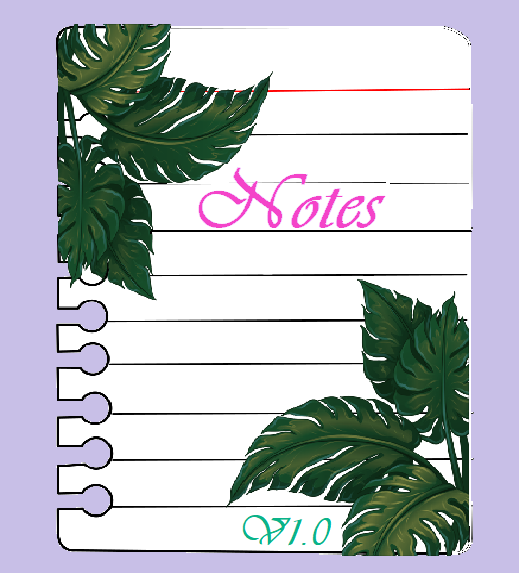

<h1 align="center">
  <strong>
    
      <b>Notes</b>
    
  </strong> 
</h1>

  
  ## О проекте.
  Вашему вниманию представлен проект выпускной квалификационной работы по разработке мобильного приложения на базе операционной системы Android, которое обеспечит возможность создания, редактирования и прослушивания заметок.
  
  Остальные возможности функционала данного программного средства будут описаны позднее.
